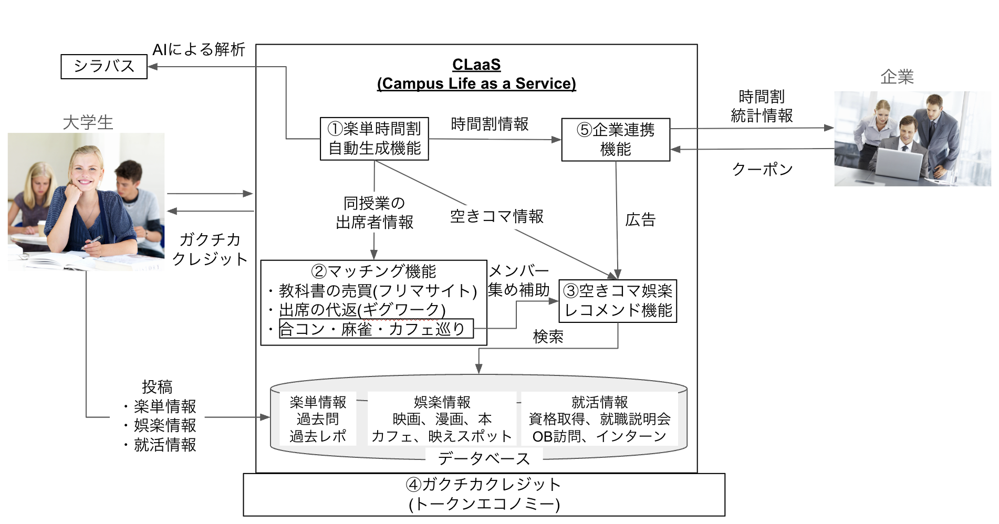
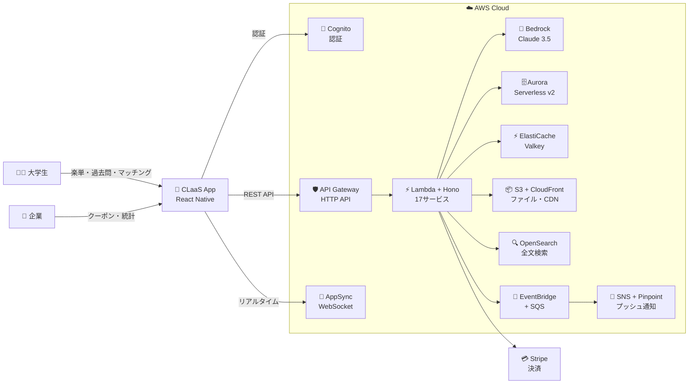

# 🎓 CLaaS — Campus Life as a Service

> 大学生活のすべてを、サービス化する。

---

## コンセプト：「人（大学生）をダメにするサービス」

Larry Wall がプログラマーの三大美徳の1つとして挙げた **「怠慢（Laziness）」**、
CLaaS はその精神を大学生活に適用します。

**「ぼっちでも、コネなしでも、大学生活を全力で楽をして楽しめる。」**

従来、大学生活を充実させるには「先輩とのつながり」が必要でした。楽単(楽に取れる単位)情報も、過去問も、試験対策も、麻雀や合コンの誘いも——すべては人脈がある人だけの特権でした。

**CLaaS では、それをすべてAIとプラットフォームが代わりにやります。**

シラバスを登録すれば、AIが「出席重要度」「レポート負荷」「テスト依存率」を分析し、最小努力で最大単位を取れる履修を提案。楽単情報によって生まれた空きコマには、「上映開始直前の映画」「同じ空きコマの学生による麻雀・合コン募集」「この時間で読み終わる漫画」をレコメンド。映画館・出版社・就活サービスなどの企業とも連携し、空きコマにぴったりのクーポンや情報が届きます。

単位取得に必要な最低限の努力だけを残し、それ以外の時間を **"最も快適な暇つぶし"** へ最適化します。

そして、この怠慢なエコシステムを支えるのが独自トークン **「ガクチカクレジット」** です。過去問・楽単情報・出席票の提供といった行動に対してクレジットが発行され、学生間で"大学生活リソース"が流通するトークンエコノミーを実現します。

**「大学生活のすべてを、サービス化する。」** それが、Campus Life as a Service です。

---

## 機能概要図



> ①楽単時間割自動生成 → ②マッチング機能 → ③空きコマ娯楽レコメンド → ④ガクチカクレジット → ⑤企業連携 の5機能が連携するエコシステム
---


## CLaaSが解決すること

| ぼっち大学生の「あるある」 | CLaaSの解決策 | 対応機能 |
|---|---|---|
| 楽単情報を教えてくれる先輩がいない | 全大学生の知恵をアプリで共有・検索 | ①楽単時間割自動生成機能 |
| 過去問を持っている友達がいない | 大学・授業別に過去問をアップロード・ダウンロード | ①楽単時間割自動生成機能 |
| 時間割を相談できる人がいない | AIが最小努力の時間割を3パターン自動生成 | ①楽単時間割自動生成機能 |
| 使い終わった教科書を譲れる後輩がいない | 教材フリマで大学全体とつながる | ②マッチング機能 |
| 授業に出席するのが面倒・代返を頼める人がいない | 代返ギグワークで信頼できる人に依頼 | ②マッチング機能 |
| 空きコマに一緒に遊ぶ人がいない | 同じ空きコマの人と麻雀・合コン・ゲームでマッチング | ②マッチング機能 |
| 空きコマに何をすればいいか考えるのが面倒 | 残り時間に合わせたコンテンツを自動提案 | ③空きコマ娯楽レコメンド機能 |
| 近くの映画館・施設を調べるのが面倒 | 地図で自動表示 | ③空きコマ娯楽レコメンド機能 |
| 就活情報を教えてくれる先輩がいない | 企業連携で空きコマにぴったりの就活情報が届く | ③空きコマ娯楽レコメンド機能 |
| 情報共有しても自分に何のメリットもない | 投稿・出席・代返でガクチカクレジット獲得 | ④ガクチカクレジット |
| 企業クーポンや就活情報を探すのが面倒 | 空きコマに合わせたクーポンが自動配信 | ⑤企業連携機能 |

---

## ドキュメント構成

審査員の方は以下の順番でお読みください。

### 📋 Step 1: コンセプトと課題分析を理解する
**→ [要件分析](aidlc-docs/inception/requirements/requirements-analysis.md)**

「人をダメにする」コンセプトの詳細、ターゲットユーザー、ガクチカクレジットエコノミーの仕組みをまとめています。

### 👤 Step 2: ユーザー視点で機能を理解する
**→ [ユーザーストーリー](aidlc-docs/inception/user-stories/user-stories.md)**

大学生がどれだけ楽をできるか、具体的なシナリオで説明しています。

### 📐 Step 3: 詳細な要件を確認する
**→ [要件定義書](aidlc-docs/inception/requirements/requirements.md)**

17の要件と受け入れ基準を定義しています。

### 🏗️ Step 4: 技術設計を確認する
**→ [アプリケーション設計](aidlc-docs/inception/application-design/design.md)**

システムアーキテクチャ、17のマイクロサービス、ER図、39の正確性プロパティを定義しています。

### 📦 Step 5: 実装計画を確認する
**→ [Unit of Work 計画](aidlc-docs/inception/units/unit-of-work.md)**

実装を段階的に進めるための作業単位の計画です。

### 📊 Step 6: プロジェクト状態を確認する
**→ [AI-DLC State](aidlc-docs/aidlc-state.md)**

AI-DLCワークフローの進捗状態です。

---

## ガクチカクレジット — 独自トークンエコノミー

CLaaSの核心は **「ガクチカクレジット（Gakuchika Credit）」** という独自トークンです。

大学生が「怠慢」を実践するほどクレジットが貯まり、そのクレジットでさらに楽をできる好循環を生み出します。

| 怠慢な行動 | 獲得クレジット |
|---|---|
| 楽単情報を投稿する | +5 |
| 過去問をアップロードする | +10 |
| ノート・レポートを共有する | +8 |
| 授業評価を書く | +3 |
| 出席票を誰かに渡す | +3 |
| 企業クーポンを使う | クーポン設定値 |
| 空きコマ情報を企業に提供する | +10 |
| 教材を無料で後輩に譲る | +5 |

貯めたクレジットは **2学期目以降のAI時間割生成** や **プレミアムコンテンツ** に使えます。課金するか、怠慢に情報共有するか。あなたはどちらを選びますか？

---

## 主要機能サマリー

```
CLaaS — ぼっち大学生をダメにする5大機能
│
├── ① 楽単時間割自動生成機能
│   ├── シラバスのAI解析（出席重要度・レポート負荷・テスト依存率）
│   ├── 楽単情報・過去問・ノート・レポートの共有（先輩不要）
│   ├── AI自動時間割生成（最小努力パターンを3案提示）
│   └── 同授業の出席者情報の共有
│
├── ② マッチング機能
│   ├── 教科書の売買（フリマサイト）
│   ├── 出席の代返（ギグワーク・Trust_Scoreで信頼性管理）
│   ├── 合コン・麻雀・カフェ巡り等のコミュニティマッチング
│   └── リアルタイムチャット
│
├── ③ 空きコマ娯楽レコメンド機能
│   ├── 空きコマの残り時間に合わせたコンテンツ自動提案
│   ├── 近くの映画館・美術館・カフェを地図で表示
│   ├── 空きコマで読み終わる漫画・書籍の提案
│   └── 就活情報・資格情報のレコメンド
│
├── ④ ガクチカクレジット（トークンエコノミー）
│   ├── 楽単情報・過去問・ノート投稿でクレジット獲得
│   ├── 出席・代返・教材譲渡でクレジット獲得
│   ├── 企業クーポン使用・空きコマ情報提供でクレジット獲得
│   └── クレジットでAI時間割生成・プレミアム機能を利用
│
└── ⑤ 企業連携機能
    ├── 企業がクーポンを発行し学生にクレジット付与
    ├── 時間割統計情報（空きコマデータ）を企業に提供
    ├── 企業向けダッシュボード（CSV出力）
    └── 広告・就活情報の配信
```


---

## システム概要図



---

## 技術スタック

> AWSネイティブ構成 + Hono によるサーバーレスアーキテクチャ

| レイヤー | 技術 | ポイント |
|---|---|---|
| フロントエンド | React Native (Expo) | iOS/Android両対応 |
| バックエンド | **Hono** on AWS Lambda | Expressの約10倍高速、Edge/Lambda両対応 |
| インフラ管理 | **AWS CDK** (TypeScript) | インフラをTypeScriptでコード化 |
| API管理 | **Amazon API Gateway** | スロットリング・認証オフロード |
| データベース | **Amazon Aurora Serverless v2** | PostgreSQL互換・オートスケール |
| キャッシュ | **Amazon ElastiCache for Valkey** | Redis互換・AWSマネージド |
| ストレージ | **Amazon S3** + **CloudFront** | CDN配信付きファイル保存 |
| AI | **Amazon Bedrock** (Claude 3.5 Sonnet) | AWSネイティブ生成AI |
| 認証 | **Amazon Cognito** | マネージド認証・大学メール検証 |
| 通知 | **Amazon SNS** + **Amazon Pinpoint** | プッシュ通知・メール |
| リアルタイム | **AWS AppSync** (WebSocket) | マネージドWebSocketチャット |
| イベント処理 | **Amazon SQS** + **EventBridge** | 非同期・イベント駆動 |
| 検索 | **Amazon OpenSearch Serverless** | 楽単・過去問の全文検索 |
| 地図 | **Amazon Location Service** | AWSネイティブ地図 |
| 監視 | **CloudWatch** + **AWS X-Ray** | 分散トレーシング |
| CI/CD | **AWS CodePipeline** + **CodeBuild** | AWSネイティブCI/CD |

---

## AI-DLC 開発プロセス

本プロジェクトは **AWS AI-DLC（AI-assisted Development Lifecycle）** を使用して開発しています。

- ✅ **Inception フェーズ完了** — 要件分析・ユーザーストーリー・アプリケーション設計・Unit of Work計画
- ⬜ Construction フェーズ（実装）
- ⬜ Operations フェーズ（デプロイ・運用）
