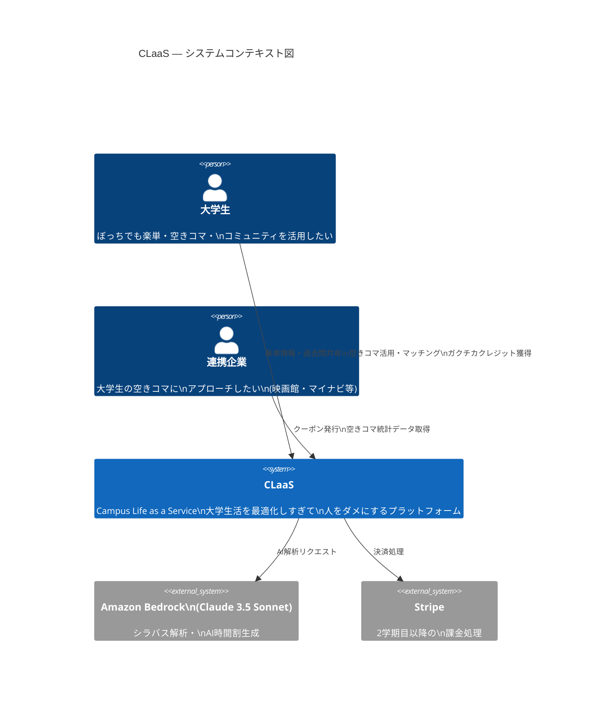
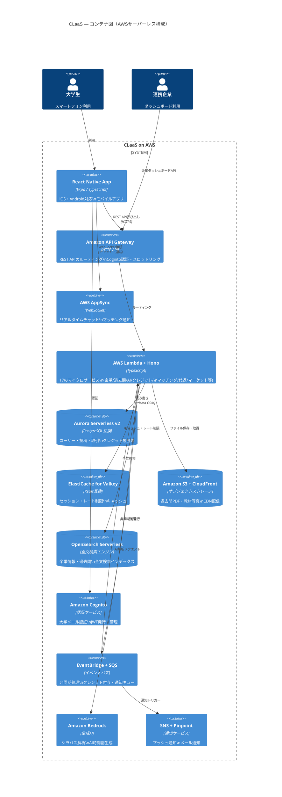

[← README に戻る](../../../README.md)

# 技術設計ドキュメント

## Campus Life as a Service（CLaaS）

---

## 概要

本ドキュメントは、大学生向け「Campus Life as a Service（CLaaS）」の技術設計を定義するものです。

### アプリの目的

- 大学生が楽単情報・過去問を共有し合うプラットフォームを提供する
- AIによるシラバス解析で履修選択を支援する
- AIによる自動時間割生成で履修計画の手間を大幅に削減する
- トークンエコノミーにより情報共有への動機付けを行う
- 空きコマ時間に合わせた娯楽・就活コンテンツを提案する
- 物理的な出席票をデジタル化し、コミュニティ貢献を報酬として認める
- 代返支援機能により相互扶助のコミュニティを形成する
- 空きコマが重複するユーザー同士のマッチング・コミュニティ機能を提供する
- 連携企業のクーポン機能により就活・娯楽サービスをお得に活用できる
- 授業テキスト・教材の譲渡マーケットプレイスで教材の有効活用とコスト削減を実現する

### 技術スタック

| レイヤー | 技術選定 | 選定理由 |
|---|---|---|
| フロントエンド | React Native (Expo) | iOS/Android両対応、QRコードスキャン対応 |
| バックエンド API | **Hono** (TypeScript) on AWS Lambda | Expressの約10倍の高速起動、Edge/Lambda両対応、型安全なRPC |
| インフラ | **AWS CDK** (TypeScript) | インフラをコードで管理、AWSリソースの一元管理 |
| API管理 | **Amazon API Gateway** (HTTP API) | Lambda統合、スロットリング、認証オフロード |
| コンピュート | **AWS Lambda** | サーバーレス、コールドスタート最小化（Hono相性◎） |
| データベース | **Amazon Aurora Serverless v2** (PostgreSQL互換) | オートスケール、サーバーレス、PostgreSQL互換 |
| キャッシュ | **Amazon ElastiCache for Valkey** | Redis互換、AWSマネージド、レート制限・セッション管理 |
| ファイルストレージ | **Amazon S3** + **CloudFront** | 過去問PDF・画像の安全な保存、CDN配信 |
| AI解析 | **Amazon Bedrock** (Claude 3.5 Sonnet) | AWSネイティブAI、シラバス解析・時間割生成 |
| 認証 | **Amazon Cognito** | マネージド認証、大学メール検証、JWT発行 |
| 通知 | **Amazon SNS** + **Amazon Pinpoint** | プッシュ通知・メール通知のAWSネイティブ統合 |
| リアルタイム通信 | **AWS AppSync** (WebSocket) | マネージドWebSocket、リアルタイムチャット |
| メッセージキュー | **Amazon SQS** + **Amazon EventBridge** | 非同期処理、イベント駆動アーキテクチャ |
| 検索 | **Amazon OpenSearch Serverless** | 楽単情報・過去問の全文検索 |
| ウイルス検査 | **Amazon Macie** + Lambda | S3アップロードファイルの自動スキャン |
| 地図 | **Amazon Location Service** | AWSネイティブ地図・施設検索 |
| 決済 | **Stripe** (AWS Marketplace連携) | 課金機能（2学期目以降） |
| 監視・ログ | **Amazon CloudWatch** + **AWS X-Ray** | 分散トレーシング、パフォーマンス監視 |
| CI/CD | **AWS CodePipeline** + **AWS CodeBuild** | AWSネイティブCI/CD |
| IaC | **AWS CDK** (TypeScript) | インフラのコード化、型安全なAWSリソース定義 |

---

## アーキテクチャ

### C4 Level 1 — システムコンテキスト図

> 「CLaaSが誰と、何と繋がっているか」の全体像



---

### C4 Level 2 — コンテナ図

> 「CLaaSの内部がどんなシステムで構成されているか」



---

### C4 Level 3 — コンポーネント図（Lambda内部）

> 「Lambdaの中の17サービスがどう分類されているか」

```mermaid
C4Component
    title CLaaS — Lambdaコンポーネント図

    Container_Boundary(lambda, "AWS Lambda + Hono（17サービス）") {

        Component(auth_svc, "Auth Service", "Cognito連携", "大学メール認証\nプロフィール管理")

        Component(core, "コア学習サービス群", "Hono / Prisma",
            "Post Service: 楽単情報\nPast Exam Service: 過去問\nSyllabus Analyzer: シラバス解析\nTimetable Generator: AI時間割\nUniversity Service: 大学・授業DB")

        Component(credit, "ガクチカクレジット群", "Hono / Prisma",
            "Token Service: クレジット管理\nTicket Manager: 出席票QR\n不正検出・残高管理")

        Component(community, "コミュニティ群", "Hono / AppSync",
            "Matching Service: 空きコママッチング\nProxy Manager: 代返\nChat Service: リアルタイムチャット")

        Component(market, "マーケットプレイス群", "Hono / Prisma",
            "Marketplace Service: 教材売買\n評価・Trust_Score管理")

        Component(platform, "プラットフォーム群", "Hono / AWS SDK",
            "Partner Service: 企業連携・クーポン\nAnalytics Service: 空きコマ統計\nContent Recommender: コンテンツ提案\nNotification Service: 通知\nMap Service: 地図")
    }

    ContainerDb(aurora, "Aurora Serverless v2", "DB", "")
    ContainerDb(valkey, "ElastiCache for Valkey", "Cache", "")
    ContainerDb(bedrock_c, "Amazon Bedrock", "AI", "")

    Rel(auth_svc, aurora, "ユーザーデータ")
    Rel(core, aurora, "投稿・授業データ")
    Rel(core, bedrock_c, "AI解析")
    Rel(credit, aurora, "クレジット取引")
    Rel(credit, valkey, "レート制限")
    Rel(community, aurora, "マッチング・代返データ")
    Rel(community, valkey, "セッション")
    Rel(market, aurora, "取引データ")
    Rel(platform, aurora, "統計・クーポンデータ")
    Rel(platform, valkey, "統計キャッシュ")
```

---

### アーキテクチャの特徴

| 特徴 | 採用技術 | 理由 |
|---|---|---|
| **完全サーバーレス** | Lambda + Aurora Serverless v2 | スケールゼロ、コスト最適化 |
| **高速API** | Hono on Lambda | Expressの約10倍の起動速度 |
| **AWSネイティブAI** | Amazon Bedrock (Claude 3.5 Sonnet) | データがAWS外に出ない |
| **イベント駆動** | EventBridge + SQS | 非同期処理、疎結合 |
| **リアルタイム** | AWS AppSync WebSocket | マネージドWebSocket |
| **IaC** | AWS CDK (TypeScript) | インフラをコードで管理 |

---

## コンポーネントとインターフェース

### Auth Service（認証サービス）

**責務**: ユーザー登録・ログイン・パスワード管理・セッション管理

```typescript
interface AuthService {
  register(email: string, password: string): Promise<{ userId: string; verificationToken: string }>;
  verifyEmail(verificationToken: string): Promise<{ sessionToken: string }>;
  login(email: string, password: string): Promise<{ sessionToken: string }>;
  logout(sessionToken: string): Promise<void>;
  requestPasswordReset(email: string): Promise<void>;
  resetPassword(resetToken: string, newPassword: string): Promise<void>;
  updateProfile(userId: string, profile: UserProfile): Promise<User>;
  validateSession(sessionToken: string): Promise<User>;
}
```

**APIエンドポイント**:

| メソッド | パス | 説明 |
|---|---|---|
| POST | /auth/register | ユーザー登録 |
| POST | /auth/verify-email | メール確認 |
| POST | /auth/login | ログイン |
| POST | /auth/logout | ログアウト |
| POST | /auth/password-reset/request | パスワードリセット要求 |
| POST | /auth/password-reset/confirm | パスワードリセット確認 |
| PUT | /auth/profile | プロフィール更新 |

---

### Post Service（楽単情報サービス）

**責務**: 楽単情報の投稿・閲覧・検索・評価管理

```typescript
interface PostService {
  createPost(userId: string, data: CreatePostInput): Promise<Post>;
  getPost(postId: string): Promise<Post>;
  listPosts(filters: PostFilters, sort: SortOption, pagination: Pagination): Promise<PaginatedResult<Post>>;
  updatePost(userId: string, postId: string, data: UpdatePostInput): Promise<Post>;
  deletePost(userId: string, postId: string): Promise<void>;
  ratePost(userId: string, postId: string, rating: 'helpful'): Promise<void>;
  reportPost(userId: string, postId: string, reason: string): Promise<void>;
}

interface PostFilters {
  universityId?: string;
  facultyId?: string;
  courseId?: string;
  teacherName?: string;
}

type SortOption = 'newest' | 'highest_rated' | 'most_viewed';
```

---

### Past Exam Service（過去問サービス）

**責務**: 過去問のアップロード・ダウンロード・検索・ウイルス検査

```typescript
interface PastExamService {
  uploadExam(userId: string, file: Buffer, metadata: ExamMetadata): Promise<PastExam>;
  downloadExam(userId: string, examId: string): Promise<{ url: string; filename: string }>;
  searchExams(filters: ExamFilters, pagination: Pagination): Promise<PaginatedResult<PastExam>>;
  getPreview(examId: string): Promise<{ previewUrl: string }>;
  reportExam(userId: string, examId: string, reason: string): Promise<void>;
  scanFile(fileBuffer: Buffer): Promise<{ clean: boolean; threat?: string }>;
}

interface ExamMetadata {
  courseId: string;
  year: number;
  examType: 'midterm' | 'final' | 'quiz' | 'other';
}
```

---

### Syllabus Analyzer Service（シラバス解析サービス）

**責務**: シラバスのパース・AI解析・難易度スコア算出

```typescript
interface SyllabusAnalyzerService {
  analyzeSyllabus(input: SyllabusInput): Promise<SyllabusAnalysisResult>;
  parsePdf(fileBuffer: Buffer): Promise<string>;
  parseToStructured(rawText: string): Promise<SyllabusObject>;
  formatToJson(syllabusObj: SyllabusObject): string;
  parseFromJson(json: string): SyllabusObject;
  formatToText(syllabusObj: SyllabusObject): string;
  getAnalysisHistory(courseId: string): Promise<SyllabusAnalysisResult[]>;
}

interface SyllabusObject {
  courseName: string;
  teacherName: string;
  evaluationMethod: string;
  courseOverview: string;
  learningObjectives: string;
  attendanceRequirement?: string;
  hasExam?: boolean;
  reportLoad?: string;
  rawText: string;
}

interface SyllabusAnalysisResult {
  courseId: string;
  difficultyScore: number; // 1-10の整数
  attendanceAnalysis: string;
  examAnalysis: string;
  reportAnalysis: string;
  gradingAnalysis: string;
  analyzedAt: Date;
}
```

---

### Token Service（トークンサービス）

**責務**: トークンの発行・消費・残高管理・不正検出

```typescript
interface TokenService {
  getBalance(userId: string): Promise<number>;
  addTokens(userId: string, amount: number, reason: TokenReason, referenceId?: string): Promise<TokenTransaction>;
  consumeTokens(userId: string, amount: number, reason: string, referenceId?: string): Promise<TokenTransaction>;
  getTransactionHistory(userId: string, pagination: Pagination): Promise<PaginatedResult<TokenTransaction>>;
  reclaimTokens(userId: string, postId: string): Promise<void>;
  detectFraud(userId: string, action: TokenAction): Promise<boolean>;
}

type TokenReason =
  | 'post_created'
  | 'exam_uploaded'
  | 'note_uploaded'
  | 'review_posted'
  | 'post_rated_helpful'
  | 'exam_downloaded_by_others'
  | 'attendance_ticket_approved'
  | 'attendance_recorded'
  | 'proxy_completed'
  | 'coupon_used'
  | 'material_donated_free'
  | 'material_sold_token'
  | 'premium_content_access'
  | 'free_period_data_consent';
```

---

### Ticket Manager Service（出席票管理サービス）

**責務**: 出席票の発行・検証・不正防止・トークン付与連携

```typescript
interface TicketManagerService {
  issueTicket(issuerId: string): Promise<AttendanceTicket>;
  validateTicket(receiverId: string, ticketCode: string): Promise<TicketValidationResult>;
  approveTicket(receiverId: string, ticketCode: string): Promise<void>;
  getTicketHistory(userId: string): Promise<AttendanceTicket[]>;
  detectAbuseIssuer(issuerId: string): Promise<boolean>;
}

interface TicketValidationResult {
  valid: boolean;
  reason?: 'invalid_code' | 'expired' | 'already_used' | 'self_approval' | 'daily_limit_exceeded';
}
```

---

### Content Recommender Service（コンテンツ推薦サービス）

**責務**: 空きコマ検出・コンテンツ推薦・ユーザー嗜好管理

```typescript
interface ContentRecommenderService {
  registerTimetable(userId: string, timetable: Timetable): Promise<FreePeriod[]>;
  getFreePeriods(userId: string): Promise<FreePeriod[]>;
  getRecommendations(userId: string, freePeriodId: string): Promise<ContentRecommendation[]>;
  updatePreferences(userId: string, preferences: ContentPreferences): Promise<void>;
  rateContent(userId: string, contentId: string, rating: 'interested' | 'not_interested'): Promise<void>;
}

interface ContentPreferences {
  categories: ContentCategory[];
  jobHuntingMode: boolean;
}

type ContentCategory = 'video' | 'music' | 'game' | 'reading' | 'internship' | 'company_info' | 'self_analysis' | 'industry_research';
```

---

### Notification Service（通知サービス）

**責務**: プッシュ通知・アプリ内通知の送信・設定管理

```typescript
interface NotificationService {
  sendNotification(userId: string, notification: NotificationPayload): Promise<void>;
  getNotifications(userId: string, pagination: Pagination): Promise<PaginatedResult<Notification>>;
  updateSettings(userId: string, settings: NotificationSettings): Promise<void>;
  getSettings(userId: string): Promise<NotificationSettings>;
}

interface NotificationSettings {
  pushEnabled: boolean;
  postRatedEnabled: boolean;
  tokenEarnedEnabled: boolean;
  contentSuggestionEnabled: boolean;
}
```

---

### University/Course Service（大学・授業サービス）

**責務**: 大学・学部・学科・授業データの管理・検索

```typescript
interface UniversityService {
  searchUniversities(query: string, limit?: number): Promise<University[]>;
  getCourses(universityId: string, filters?: CourseFilters): Promise<Course[]>;
  requestNewUniversity(userId: string, data: UniversityRequest): Promise<void>;
  adminApproveUniversity(adminId: string, requestId: string): Promise<University>;
}
```

---

### Timetable Generator Service（自動時間割生成サービス）

**責務**: 大学・学部・年度入力による最適時間割生成・半期予定表作成

```typescript
interface TimetableGeneratorService {
  generateTimetable(userId: string, input: TimetableInput): Promise<TimetableCandidate[]>;
  saveTimetable(userId: string, timetableId: string): Promise<Timetable>;
  updateTimetable(userId: string, timetableId: string, edits: TimetableEdit[]): Promise<Timetable>;
  getSemesterSchedule(userId: string, timetableId: string): Promise<SemesterSchedule>;
  getFreePeriods(userId: string, timetableId: string): Promise<FreePeriod[]>;
}

interface TimetableInput {
  universityId: string;
  facultyId: string;
  year: number;
  semester: 'spring' | 'fall';
  targetCredits: number;
  preferences?: TimetablePreferences;
}

interface TimetablePreferences {
  avoidEarlyMorning?: boolean;
  avoidLateEvening?: boolean;
  preferredDays?: number[]; // 0=月, 1=火, ...
  excludeCourseIds?: string[];
}

interface TimetableCandidate {
  id: string;
  courses: TimetableCourse[];
  totalCredits: number;
  totalDifficultyScore: number;
  freePeriods: FreePeriod[];
  rationale: string;
  generatedAt: Date;
}

interface TimetableCourse {
  courseId: string;
  courseName: string;
  teacherName: string;
  dayOfWeek: number;
  period: number;
  credits: number;
  difficultyScore: number;
  attendanceRequirement: string;
  examSchedule?: Date;
  reportDeadlines?: Date[];
}

interface SemesterSchedule {
  timetableId: string;
  semester: 'spring' | 'fall';
  year: number;
  events: ScheduleEvent[];
}

interface ScheduleEvent {
  date: Date;
  type: 'class' | 'exam' | 'report_deadline' | 'free_period';
  courseId?: string;
  description: string;
}
```

**APIエンドポイント**:

| メソッド | パス | 説明 |
|---|---|---|
| POST | /timetable/generate | 時間割候補生成 |
| POST | /timetable/save | 時間割保存 |
| PUT | /timetable/:id | 時間割手動編集 |
| GET | /timetable/:id/schedule | 半期予定表取得 |
| GET | /timetable/:id/free-periods | 空きコマ一覧取得 |

---

### Proxy Manager Service（代返管理サービス）

**責務**: 代返依頼・受諾・完了・評価・Trust_Score管理

```typescript
interface ProxyManagerService {
  createRequest(requesterId: string, data: ProxyRequestInput): Promise<ProxyRequest>;
  acceptRequest(agentId: string, requestId: string): Promise<ProxyRequest>;
  submitCompletion(agentId: string, requestId: string, attendanceCode: string): Promise<ProxyRequest>;
  submitRating(userId: string, requestId: string, rating: number): Promise<void>;
  getTrustScore(userId: string): Promise<number>;
  getRequests(filters: ProxyRequestFilters): Promise<PaginatedResult<ProxyRequest>>;
  detectFraud(requestId: string): Promise<boolean>;
  applyPenalty(agentId: string, requestId: string): Promise<void>;
}

interface ProxyRequestInput {
  courseId: string;
  classDate: Date;
  classroom: string;
  rewardTokens: number;
  notes?: string;
}

interface ProxyRequest {
  id: string;
  requesterId: string;
  agentId?: string;
  courseId: string;
  classDate: Date;
  classroom: string;
  rewardTokens: number;
  status: 'open' | 'accepted' | 'completed' | 'fraud_detected' | 'cancelled';
  requesterRating?: number;
  agentRating?: number;
  createdAt: Date;
  updatedAt: Date;
}

interface ProxyRequestFilters {
  universityId?: string;
  courseId?: string;
  status?: ProxyRequest['status'];
  agentId?: string;
  requesterId?: string;
}
```

**APIエンドポイント**:

| メソッド | パス | 説明 |
|---|---|---|
| POST | /proxy/requests | 代返依頼作成 |
| POST | /proxy/requests/:id/accept | 代返依頼受諾 |
| POST | /proxy/requests/:id/complete | 代返完了報告 |
| POST | /proxy/requests/:id/rate | 相互評価入力 |
| GET | /proxy/requests | 代返依頼一覧取得 |
| GET | /proxy/trust-score/:userId | Trust_Score取得 |

---

### Matching Service（マッチングサービス）

**責務**: 空きコマ重複ユーザーのマッチング・コミュニティ管理

```typescript
interface MatchingService {
  enableMatching(userId: string): Promise<void>;
  disableMatching(userId: string): Promise<void>;
  getCandidates(userId: string): Promise<MatchCandidate[]>;
  sendMatchRequest(fromUserId: string, toUserId: string): Promise<void>;
  respondToMatch(userId: string, matchId: string, accept: boolean): Promise<MatchResult>;
  createCommunity(userId: string, data: CommunityInput): Promise<Community>;
  joinCommunity(userId: string, communityId: string): Promise<void>;
  leaveCommunity(userId: string, communityId: string): Promise<void>;
  getCommunities(filters: CommunityFilters): Promise<PaginatedResult<Community>>;
  reportCommunityContent(userId: string, messageId: string, reason: string): Promise<void>;
}

interface MatchCandidate {
  userId: string;
  displayName: string;
  university: string;
  commonFreePeriods: FreePeriod[];
  commonInterests: ContentCategory[];
  matchScore: number;
}

interface MatchResult {
  matched: boolean;
  chatSessionId?: string;
}

interface CommunityInput {
  name: string;
  category: CommunityCategory;
  description: string;
  visibility: 'public' | 'university_only' | 'invite_only';
}

type CommunityCategory =
  | 'sports'
  | 'board_games'
  | 'video_games'
  | 'social'
  | 'part_time_job'
  | 'other';

interface Community {
  id: string;
  name: string;
  category: CommunityCategory;
  description: string;
  visibility: 'public' | 'university_only' | 'invite_only';
  adminUserId: string;
  memberCount: number;
  createdAt: Date;
}

interface CommunityFilters {
  universityId?: string;
  category?: CommunityCategory;
  visibility?: Community['visibility'];
}
```

**APIエンドポイント**:

| メソッド | パス | 説明 |
|---|---|---|
| POST | /matching/enable | マッチング機能有効化 |
| POST | /matching/disable | マッチング機能無効化 |
| GET | /matching/candidates | マッチング候補取得 |
| POST | /matching/request | マッチング申請送信 |
| POST | /matching/:id/respond | マッチング申請応答 |
| POST | /communities | コミュニティ作成 |
| POST | /communities/:id/join | コミュニティ参加 |
| POST | /communities/:id/leave | コミュニティ退出 |
| GET | /communities | コミュニティ一覧取得 |

---

### Chat Service（チャットサービス）

**責務**: リアルタイムチャット（Socket.io）・コミュニティメッセージ配信

```typescript
interface ChatService {
  createSession(userIds: string[]): Promise<ChatSession>;
  sendMessage(userId: string, sessionId: string, content: string): Promise<ChatMessage>;
  getMessages(sessionId: string, pagination: Pagination): Promise<PaginatedResult<ChatMessage>>;
  sendCommunityMessage(userId: string, communityId: string, content: string): Promise<ChatMessage>;
  getCommunityMessages(communityId: string, pagination: Pagination): Promise<PaginatedResult<ChatMessage>>;
  hideMessage(adminId: string, messageId: string): Promise<void>;
}

interface ChatSession {
  id: string;
  participantIds: string[];
  createdAt: Date;
}

interface ChatMessage {
  id: string;
  sessionId?: string;
  communityId?: string;
  senderId: string;
  content: string;
  isHidden: boolean;
  createdAt: Date;
}
```

**Socket.ioイベント**:

| イベント名 | 方向 | 説明 |
|---|---|---|
| `join_session` | クライアント→サーバー | チャットセッション参加 |
| `leave_session` | クライアント→サーバー | チャットセッション退出 |
| `send_message` | クライアント→サーバー | メッセージ送信 |
| `new_message` | サーバー→クライアント | 新着メッセージ受信 |
| `join_community` | クライアント→サーバー | コミュニティルーム参加 |
| `community_message` | サーバー→クライアント | コミュニティメッセージ受信 |

---

### Partner Service（企業連携サービス）

**責務**: 企業連携・クーポン発行・管理・使用検証

```typescript
interface PartnerService {
  registerPartner(data: PartnerInput): Promise<Partner>;
  issueCoupon(partnerId: string, data: CouponInput): Promise<Coupon>;
  useCoupon(userId: string, couponCode: string): Promise<CouponUseResult>;
  getCoupons(filters: CouponFilters): Promise<PaginatedResult<Coupon>>;
  getCouponStats(partnerId: string, couponId: string): Promise<CouponStats>;
  validateCoupon(userId: string, couponCode: string): Promise<CouponValidationResult>;
}

interface PartnerInput {
  name: string;
  category: string;
  contactEmail: string;
  description: string;
}

interface Partner {
  id: string;
  name: string;
  category: string;
  contactEmail: string;
  description: string;
  isActive: boolean;
  createdAt: Date;
}

interface CouponInput {
  title: string;
  description: string;
  tokenReward: number;
  expiresAt: Date;
  maxUsageCount: number;
  maxUsagePerUser: number;
  targetCategories?: ContentCategory[];
}

interface Coupon {
  id: string;
  partnerId: string;
  code: string;
  title: string;
  description: string;
  tokenReward: number;
  expiresAt: Date;
  maxUsageCount: number;
  maxUsagePerUser: number;
  usedCount: number;
  isActive: boolean;
  createdAt: Date;
}

interface CouponUseResult {
  success: boolean;
  tokensAwarded: number;
  reason?: string;
}

interface CouponValidationResult {
  valid: boolean;
  reason?: 'expired' | 'already_used' | 'limit_exceeded' | 'not_found';
}

interface CouponStats {
  totalUsed: number;
  remaining: number;
  usageByDate: { date: string; count: number }[];
}

interface CouponFilters {
  partnerId?: string;
  isActive?: boolean;
  targetCategory?: ContentCategory;
}
```

**APIエンドポイント**:

| メソッド | パス | 説明 |
|---|---|---|
| POST | /partners | 企業登録 |
| POST | /partners/:id/coupons | クーポン発行 |
| POST | /coupons/use | クーポン使用 |
| GET | /coupons | クーポン一覧取得 |
| GET | /partners/:id/coupons/:couponId/stats | クーポン使用統計 |

---

### Marketplace Service（教材マーケットプレイスサービス）

**責務**: 教材出品・申し込み・取引管理・評価・Marketplace_Trust_Score管理

```typescript
interface MarketplaceService {
  createListing(sellerId: string, data: ListingInput): Promise<Listing>;
  getListing(listingId: string): Promise<Listing>;
  searchListings(filters: ListingFilters, pagination: Pagination): Promise<PaginatedResult<Listing>>;
  applyToListing(buyerId: string, listingId: string): Promise<MarketplaceTransaction>;
  respondToApplication(sellerId: string, transactionId: string, accept: boolean): Promise<MarketplaceTransaction>;
  completeTransaction(userId: string, transactionId: string): Promise<MarketplaceTransaction>;
  submitRating(userId: string, transactionId: string, rating: number): Promise<void>;
  cancelListing(sellerId: string, listingId: string): Promise<void>;
  reportListing(userId: string, listingId: string, reason: string): Promise<void>;
  getMarketplaceTrustScore(userId: string): Promise<number>;
  uploadListingPhoto(sellerId: string, listingId: string, file: Buffer, mimeType: string): Promise<ListingPhoto>;
}

interface ListingInput {
  title: string;
  author?: string;
  publisher?: string;
  courseId?: string;
  itemCondition: ItemCondition;
  transactionType: TransactionType;
  price?: number;
  tokenAmount?: number;
  deliveryMethod: DeliveryMethod;
  description: string;
  meetingLocation?: string;
}

type ItemCondition = 'good' | 'has_writing' | 'has_damage' | 'other';
type TransactionType = 'free' | 'token' | 'cash';
type DeliveryMethod = 'in_person' | 'shipping';

interface Listing {
  id: string;
  sellerId: string;
  title: string;
  author?: string;
  publisher?: string;
  courseId?: string;
  itemCondition: ItemCondition;
  transactionType: TransactionType;
  price?: number;
  tokenAmount?: number;
  deliveryMethod: DeliveryMethod;
  description: string;
  meetingLocation?: string;
  status: 'active' | 'in_transaction' | 'completed' | 'cancelled' | 'hidden';
  photos: ListingPhoto[];
  createdAt: Date;
  updatedAt: Date;
}

interface ListingPhoto {
  id: string;
  listingId: string;
  fileKey: string;
  mimeType: string;
  fileSize: number;
  order: number;
  createdAt: Date;
}

interface MarketplaceTransaction {
  id: string;
  listingId: string;
  sellerId: string;
  buyerId: string;
  transactionType: TransactionType;
  deliveryMethod: DeliveryMethod;
  status: 'pending' | 'in_progress' | 'completed' | 'cancelled';
  sellerRating?: number;
  buyerRating?: number;
  completedAt?: Date;
  createdAt: Date;
}

interface ListingFilters {
  universityId?: string;
  facultyId?: string;
  courseId?: string;
  title?: string;
  transactionType?: TransactionType;
  itemCondition?: ItemCondition;
}
```

**APIエンドポイント**:

| メソッド | パス | 説明 |
|---|---|---|
| POST | /marketplace/listings | 出品登録 |
| GET | /marketplace/listings | 出品一覧検索 |
| GET | /marketplace/listings/:id | 出品詳細取得 |
| POST | /marketplace/listings/:id/apply | 申し込み送信 |
| POST | /marketplace/transactions/:id/respond | 申し込み承認/拒否 |
| POST | /marketplace/transactions/:id/complete | 取引完了 |
| POST | /marketplace/transactions/:id/rate | 評価入力 |
| DELETE | /marketplace/listings/:id | 出品取り消し |
| POST | /marketplace/listings/:id/photos | 写真アップロード |
| GET | /marketplace/trust-score/:userId | Marketplace_Trust_Score取得 |

---

### Map Service（地図サービス）

**責務**: 近隣施設検索・地図表示（Google Maps API連携）

```typescript
interface MapService {
  searchNearbyFacilities(location: GeoLocation, category: FacilityCategory, radius?: number): Promise<Facility[]>;
  getFacilityDetails(placeId: string): Promise<FacilityDetail>;
  getStaticMapUrl(location: GeoLocation, zoom?: number): Promise<string>;
}

interface GeoLocation {
  latitude: number;
  longitude: number;
}

type FacilityCategory = 'cinema' | 'museum' | 'cafe' | 'library' | 'restaurant' | 'bookstore' | 'other';

interface Facility {
  placeId: string;
  name: string;
  category: FacilityCategory;
  location: GeoLocation;
  address: string;
  distanceMeters: number;
  rating?: number;
  openNow?: boolean;
}

interface FacilityDetail extends Facility {
  phoneNumber?: string;
  website?: string;
  openingHours?: string[];
  photos?: string[];
}
```

---

### Analytics Service（空きコマ統計サービス）

**責務**: 空きコマ統計データの集計・匿名化・企業向け提供・Data_Consent管理

```typescript
interface AnalyticsService {
  setDataConsent(userId: string, consent: boolean): Promise<void>;
  getDataConsent(userId: string): Promise<DataConsent>;
  getFreePeriodStats(partnerId: string, filters: FreePeriodStatsFilters): Promise<FreePeriodStats[]>;
  exportFreePeriodStats(partnerId: string, filters: FreePeriodStatsFilters): Promise<Buffer>; // CSV
  refreshStats(): Promise<void>; // 24時間ごとのバッチ処理
}

interface DataConsent {
  userId: string;
  consentGiven: boolean;
  consentGivenAt?: Date;
  revokedAt?: Date;
}

interface FreePeriodStatsFilters {
  universityId?: string;
  facultyId?: string;
  dayOfWeek?: number; // 0=月〜4=金
  period?: number;    // 1〜5限
  semesterId?: string;
}

interface FreePeriodStats {
  universityName: string;
  facultyName: string;
  dayOfWeek: number;
  period: number;
  userCount: number; // 5名未満の場合は提供しない
}
```

**APIエンドポイント**:

| メソッド | パス | 説明 |
|---|---|---|
| POST | /analytics/consent | Data_Consent設定（オン/オフ） |
| GET | /analytics/consent | Data_Consent状態取得 |
| GET | /analytics/free-period-stats | 空きコマ統計取得（企業向け） |
| GET | /analytics/free-period-stats/export | 統計CSVエクスポート（企業向け） |

---

## データモデル

### ER図

```mermaid
erDiagram
    User {
        uuid id PK
        string email UK
        string password_hash
        string university_id FK
        string faculty_id FK
        string department_id FK
        int grade
        bool email_verified
        int failed_login_count
        timestamp locked_until
        timestamp created_at
        timestamp updated_at
    }

    University {
        uuid id PK
        string name
        string name_kana
        bool approved
        timestamp created_at
    }

    Faculty {
        uuid id PK
        uuid university_id FK
        string name
    }

    Department {
        uuid id PK
        uuid faculty_id FK
        string name
    }

    Course {
        uuid id PK
        uuid university_id FK
        uuid faculty_id FK
        string name
        string teacher_name
        string syllabus_text
        timestamp created_at
    }

    Post {
        uuid id PK
        uuid user_id FK
        uuid course_id FK
        string comment
        int difficulty_rating
        string evaluation_method
        int helpful_count
        int view_count
        bool is_deleted
        timestamp created_at
        timestamp updated_at
    }

    PastExam {
        uuid id PK
        uuid user_id FK
        uuid course_id FK
        int year
        string exam_type
        string file_key
        string file_name
        int file_size
        string mime_type
        int download_count
        bool is_quarantined
        bool is_hidden
        timestamp created_at
    }

    SyllabusAnalysis {
        uuid id PK
        uuid course_id FK
        int difficulty_score
        string attendance_analysis
        string exam_analysis
        string report_analysis
        string grading_analysis
        bool is_latest
        timestamp analyzed_at
    }

    TokenTransaction {
        uuid id PK
        uuid user_id FK
        int amount
        string reason
        string reference_id
        int balance_after
        timestamp created_at
    }

    AttendanceTicket {
        uuid id PK
        uuid issuer_id FK
        uuid receiver_id FK
        string ticket_code UK
        bool is_used
        timestamp expires_at
        timestamp approved_at
        timestamp created_at
    }

    Notification {
        uuid id PK
        uuid user_id FK
        string type
        string title
        string body
        jsonb payload
        bool is_read
        timestamp created_at
    }

    ContentPreference {
        uuid id PK
        uuid user_id FK
        string category
        float weight
        timestamp updated_at
    }

    Timetable {
        uuid id PK
        uuid user_id FK
        int day_of_week
        int period
        uuid course_id FK
    }

    ProxyRequest {
        uuid id PK
        uuid requester_id FK
        uuid agent_id FK
        uuid course_id FK
        timestamp class_date
        string classroom
        int reward_tokens
        string status
        int requester_rating
        int agent_rating
        timestamp created_at
        timestamp updated_at
    }

    Community {
        uuid id PK
        string name
        string category
        string description
        string visibility
        uuid admin_user_id FK
        int member_count
        timestamp created_at
    }

    CommunityMember {
        uuid id PK
        uuid community_id FK
        uuid user_id FK
        string role
        timestamp joined_at
    }

    ChatMessage {
        uuid id PK
        uuid session_id FK
        uuid community_id FK
        uuid sender_id FK
        string content
        bool is_hidden
        timestamp created_at
    }

    Partner {
        uuid id PK
        string name
        string category
        string contact_email
        string description
        bool is_active
        timestamp created_at
    }

    Coupon {
        uuid id PK
        uuid partner_id FK
        string code UK
        string title
        string description
        int token_reward
        timestamp expires_at
        int max_usage_count
        int max_usage_per_user
        int used_count
        bool is_active
        timestamp created_at
    }

    CouponUsage {
        uuid id PK
        uuid coupon_id FK
        uuid user_id FK
        timestamp used_at
    }

    Listing {
        uuid id PK
        uuid seller_id FK
        uuid course_id FK
        string title
        string author
        string publisher
        string item_condition
        string transaction_type
        int price
        int token_amount
        string delivery_method
        string description
        string meeting_location
        string status
        timestamp created_at
        timestamp updated_at
    }

    MarketplaceTransaction {
        uuid id PK
        uuid listing_id FK
        uuid seller_id FK
        uuid buyer_id FK
        string transaction_type
        string delivery_method
        string status
        int seller_rating
        int buyer_rating
        timestamp completed_at
        timestamp created_at
    }

    ListingPhoto {
        uuid id PK
        uuid listing_id FK
        string file_key
        string mime_type
        int file_size
        int order
        timestamp created_at
    }

    DataConsent {
        uuid id PK
        uuid user_id FK
        bool consent_given
        timestamp consent_given_at
        timestamp revoked_at
        timestamp created_at
        timestamp updated_at
    }

    User ||--o{ Post : "投稿する"
    User ||--o{ PastExam : "アップロードする"
    User ||--o{ TokenTransaction : "取引する"
    User ||--o{ AttendanceTicket : "発行する(issuer)"
    User ||--o{ AttendanceTicket : "受け取る(receiver)"
    User ||--o{ Notification : "受け取る"
    User ||--o{ ContentPreference : "設定する"
    User ||--o{ Timetable : "登録する"
    User }o--|| University : "所属する"
    User ||--o{ ProxyRequest : "依頼する(requester)"
    User ||--o{ ProxyRequest : "引き受ける(agent)"
    User ||--o{ CommunityMember : "参加する"
    User ||--o{ ChatMessage : "送信する"
    User ||--o{ CouponUsage : "使用する"
    User ||--o{ Listing : "出品する"
    User ||--o{ MarketplaceTransaction : "取引する(seller)"
    User ||--o{ MarketplaceTransaction : "取引する(buyer)"
    User ||--o| DataConsent : "同意する"
    University ||--o{ Faculty : "持つ"
    Faculty ||--o{ Department : "持つ"
    University ||--o{ Course : "開講する"
    Course ||--o{ Post : "対象となる"
    Course ||--o{ PastExam : "対象となる"
    Course ||--o{ SyllabusAnalysis : "解析される"
    Course ||--o{ ProxyRequest : "対象となる"
    Course ||--o{ Listing : "紐付く"
    Community ||--o{ CommunityMember : "持つ"
    Community ||--o{ ChatMessage : "持つ"
    Partner ||--o{ Coupon : "発行する"
    Coupon ||--o{ CouponUsage : "使用される"
    Listing ||--o{ ListingPhoto : "持つ"
    Listing ||--o{ MarketplaceTransaction : "対象となる"
```



### 主要テーブル詳細

#### users テーブル

```sql
CREATE TABLE users (
    id UUID PRIMARY KEY DEFAULT gen_random_uuid(),
    email VARCHAR(255) UNIQUE NOT NULL,
    password_hash VARCHAR(255) NOT NULL,
    university_id UUID REFERENCES universities(id),
    faculty_id UUID REFERENCES faculties(id),
    department_id UUID REFERENCES departments(id),
    grade SMALLINT CHECK (grade BETWEEN 1 AND 6),
    email_verified BOOLEAN NOT NULL DEFAULT FALSE,
    failed_login_count SMALLINT NOT NULL DEFAULT 0,
    locked_until TIMESTAMP WITH TIME ZONE,
    push_notification_enabled BOOLEAN NOT NULL DEFAULT TRUE,
    created_at TIMESTAMP WITH TIME ZONE NOT NULL DEFAULT NOW(),
    updated_at TIMESTAMP WITH TIME ZONE NOT NULL DEFAULT NOW()
);
```

#### attendance_tickets テーブル

```sql
CREATE TABLE attendance_tickets (
    id UUID PRIMARY KEY DEFAULT gen_random_uuid(),
    issuer_id UUID NOT NULL REFERENCES users(id),
    receiver_id UUID REFERENCES users(id),
    ticket_code VARCHAR(64) UNIQUE NOT NULL,
    is_used BOOLEAN NOT NULL DEFAULT FALSE,
    expires_at TIMESTAMP WITH TIME ZONE NOT NULL,
    approved_at TIMESTAMP WITH TIME ZONE,
    created_at TIMESTAMP WITH TIME ZONE NOT NULL DEFAULT NOW()
);

CREATE INDEX idx_attendance_tickets_code ON attendance_tickets(ticket_code);
CREATE INDEX idx_attendance_tickets_issuer ON attendance_tickets(issuer_id, created_at);
```

#### token_transactions テーブル

```sql
CREATE TABLE token_transactions (
    id UUID PRIMARY KEY DEFAULT gen_random_uuid(),
    user_id UUID NOT NULL REFERENCES users(id),
    amount INTEGER NOT NULL,
    reason VARCHAR(100) NOT NULL,
    reference_id VARCHAR(255),
    balance_after INTEGER NOT NULL CHECK (balance_after >= 0),
    created_at TIMESTAMP WITH TIME ZONE NOT NULL DEFAULT NOW()
);

CREATE INDEX idx_token_transactions_user ON token_transactions(user_id, created_at DESC);
```

#### listings テーブル

```sql
CREATE TABLE listings (
    id UUID PRIMARY KEY DEFAULT gen_random_uuid(),
    seller_id UUID NOT NULL REFERENCES users(id),
    course_id UUID REFERENCES courses(id),
    title VARCHAR(255) NOT NULL,
    author VARCHAR(255),
    publisher VARCHAR(255),
    item_condition VARCHAR(20) NOT NULL CHECK (item_condition IN ('good', 'has_writing', 'has_damage', 'other')),
    transaction_type VARCHAR(10) NOT NULL CHECK (transaction_type IN ('free', 'token', 'cash')),
    price INTEGER,
    token_amount INTEGER,
    delivery_method VARCHAR(20) NOT NULL CHECK (delivery_method IN ('in_person', 'shipping')),
    description TEXT,
    meeting_location VARCHAR(255),
    status VARCHAR(20) NOT NULL DEFAULT 'active' CHECK (status IN ('active', 'in_transaction', 'completed', 'cancelled', 'hidden')),
    created_at TIMESTAMP WITH TIME ZONE NOT NULL DEFAULT NOW(),
    updated_at TIMESTAMP WITH TIME ZONE NOT NULL DEFAULT NOW()
);

CREATE INDEX idx_listings_seller ON listings(seller_id, status);
CREATE INDEX idx_listings_course ON listings(course_id);
CREATE INDEX idx_listings_status ON listings(status, created_at DESC);
```

#### marketplace_transactions テーブル

```sql
CREATE TABLE marketplace_transactions (
    id UUID PRIMARY KEY DEFAULT gen_random_uuid(),
    listing_id UUID NOT NULL REFERENCES listings(id),
    seller_id UUID NOT NULL REFERENCES users(id),
    buyer_id UUID NOT NULL REFERENCES users(id),
    transaction_type VARCHAR(10) NOT NULL CHECK (transaction_type IN ('free', 'token', 'cash')),
    delivery_method VARCHAR(20) NOT NULL CHECK (delivery_method IN ('in_person', 'shipping')),
    status VARCHAR(20) NOT NULL DEFAULT 'pending' CHECK (status IN ('pending', 'in_progress', 'completed', 'cancelled')),
    seller_rating SMALLINT CHECK (seller_rating BETWEEN 1 AND 5),
    buyer_rating SMALLINT CHECK (buyer_rating BETWEEN 1 AND 5),
    completed_at TIMESTAMP WITH TIME ZONE,
    created_at TIMESTAMP WITH TIME ZONE NOT NULL DEFAULT NOW()
);

CREATE INDEX idx_marketplace_transactions_listing ON marketplace_transactions(listing_id);
CREATE INDEX idx_marketplace_transactions_seller ON marketplace_transactions(seller_id);
CREATE INDEX idx_marketplace_transactions_buyer ON marketplace_transactions(buyer_id);
```

#### proxy_requests テーブル

```sql
CREATE TABLE proxy_requests (
    id UUID PRIMARY KEY DEFAULT gen_random_uuid(),
    requester_id UUID NOT NULL REFERENCES users(id),
    agent_id UUID REFERENCES users(id),
    course_id UUID NOT NULL REFERENCES courses(id),
    class_date TIMESTAMP WITH TIME ZONE NOT NULL,
    classroom VARCHAR(100) NOT NULL,
    reward_tokens INTEGER NOT NULL CHECK (reward_tokens > 0),
    status VARCHAR(20) NOT NULL DEFAULT 'open' CHECK (status IN ('open', 'accepted', 'completed', 'fraud_detected', 'cancelled')),
    requester_rating SMALLINT CHECK (requester_rating BETWEEN 1 AND 5),
    agent_rating SMALLINT CHECK (agent_rating BETWEEN 1 AND 5),
    created_at TIMESTAMP WITH TIME ZONE NOT NULL DEFAULT NOW(),
    updated_at TIMESTAMP WITH TIME ZONE NOT NULL DEFAULT NOW()
);

CREATE INDEX idx_proxy_requests_requester ON proxy_requests(requester_id);
CREATE INDEX idx_proxy_requests_agent ON proxy_requests(agent_id);
CREATE INDEX idx_proxy_requests_course ON proxy_requests(course_id, class_date);
CREATE INDEX idx_proxy_requests_status ON proxy_requests(status);
```

#### communities テーブル

```sql
CREATE TABLE communities (
    id UUID PRIMARY KEY DEFAULT gen_random_uuid(),
    name VARCHAR(100) NOT NULL,
    category VARCHAR(30) NOT NULL CHECK (category IN ('sports', 'board_games', 'video_games', 'social', 'part_time_job', 'other')),
    description TEXT,
    visibility VARCHAR(20) NOT NULL DEFAULT 'public' CHECK (visibility IN ('public', 'university_only', 'invite_only')),
    admin_user_id UUID NOT NULL REFERENCES users(id),
    university_id UUID REFERENCES universities(id),
    member_count INTEGER NOT NULL DEFAULT 0,
    created_at TIMESTAMP WITH TIME ZONE NOT NULL DEFAULT NOW()
);

CREATE INDEX idx_communities_category ON communities(category);
CREATE INDEX idx_communities_university ON communities(university_id);
```

#### coupons テーブル

```sql
CREATE TABLE coupons (
    id UUID PRIMARY KEY DEFAULT gen_random_uuid(),
    partner_id UUID NOT NULL REFERENCES partners(id),
    code VARCHAR(64) UNIQUE NOT NULL,
    title VARCHAR(255) NOT NULL,
    description TEXT,
    token_reward INTEGER NOT NULL CHECK (token_reward > 0),
    expires_at TIMESTAMP WITH TIME ZONE NOT NULL,
    max_usage_count INTEGER NOT NULL,
    max_usage_per_user INTEGER NOT NULL DEFAULT 1,
    used_count INTEGER NOT NULL DEFAULT 0,
    is_active BOOLEAN NOT NULL DEFAULT TRUE,
    created_at TIMESTAMP WITH TIME ZONE NOT NULL DEFAULT NOW()
);

CREATE INDEX idx_coupons_partner ON coupons(partner_id);
CREATE INDEX idx_coupons_code ON coupons(code);
CREATE INDEX idx_coupons_active ON coupons(is_active, expires_at);
```

#### data_consents テーブル

```sql
CREATE TABLE data_consents (
    id UUID PRIMARY KEY DEFAULT gen_random_uuid(),
    user_id UUID NOT NULL UNIQUE REFERENCES users(id),
    consent_given BOOLEAN NOT NULL DEFAULT FALSE,
    consent_given_at TIMESTAMP WITH TIME ZONE,
    revoked_at TIMESTAMP WITH TIME ZONE,
    created_at TIMESTAMP WITH TIME ZONE NOT NULL DEFAULT NOW(),
    updated_at TIMESTAMP WITH TIME ZONE NOT NULL DEFAULT NOW()
);

CREATE INDEX idx_data_consents_user ON data_consents(user_id);
CREATE INDEX idx_data_consents_consent ON data_consents(consent_given);
```

---

## 正確性プロパティ


*プロパティとは、システムのすべての有効な実行において真であるべき特性または振る舞いのことです。つまり、システムが何をすべきかについての形式的な記述です。プロパティは、人間が読める仕様と機械で検証可能な正確性保証の橋渡しをします。*

### プロパティ1: メールアドレスバリデーションの一貫性

*任意の* メールアドレス文字列に対して、バリデーション関数は大学メール形式（ac.jpドメイン等）を正しく受け入れ、不正な形式を拒否する。同じ入力に対して常に同じ結果を返す（決定論的）。

**検証対象: 要件1.1**

---

### プロパティ2: パスワードハッシュ化の安全性

*任意の* パスワード文字列に対して、bcryptハッシュ化後の値は元のパスワードと異なり、かつ同じパスワードで検証（verify）すると真を返す（ラウンドトリップ特性）。

**検証対象: 要件1.6**

---

### プロパティ3: ログイン失敗ロックアウトの境界値

*任意の* ユーザーに対して、ログイン失敗回数が5回に達した時点でアカウントがロックされ、4回以下ではロックされない（境界値不変条件）。

**検証対象: 要件1.4**

---

### プロパティ4: 投稿フィルター検索の正確性

*任意の* 検索フィルター（大学・学部・授業名・担当教員名）に対して、返される投稿はすべてそのフィルター条件を満たす。フィルター条件を満たさない投稿は結果に含まれない。

**検証対象: 要件2.2**

---

### プロパティ5: 投稿ソートの順序保証

*任意の* 投稿リストに対して、「新しい順」ソートでは投稿日時が降順、「評価の高い順」ではhelpful_countが降順、「閲覧数の多い順」ではview_countが降順になる。

**検証対象: 要件2.3**

---

### プロパティ6: 投稿編集権限の排他性

*任意の* ユーザーIDと投稿IDの組み合わせに対して、投稿者本人（user_id一致）のみが編集・削除操作を成功させることができ、それ以外のユーザーは拒否される。

**検証対象: 要件2.6**

---

### プロパティ7: ファイルバリデーションの網羅性

*任意の* ファイルに対して、MIME typeがPDF・PNG・JPG・JPEGでない場合、またはファイルサイズが50MBを超える場合は拒否される。有効な形式・サイズのファイルは受け入れられる。

**検証対象: 要件3.2**

---

### プロパティ8: 過去問検索フィルターの正確性

*任意の* 検索条件（大学・学部・授業名・年度・試験種別）に対して、返される過去問はすべてその条件を満たす。条件を満たさない過去問は結果に含まれない。

**検証対象: 要件3.4**

---

### プロパティ9: Difficulty_Scoreの範囲不変条件

*任意の* シラバステキスト入力（500文字以上）に対して、Syllabus_Analyzerが算出するDifficulty_Scoreは常に1以上10以下の整数値である。

**検証対象: 要件4.2**

---

### プロパティ10: シラバス解析結果の必須フィールド完全性

*任意の* 有効なシラバス入力に対して、解析結果には「出席要件」「試験の有無」「レポート課題の量」「成績評価方法」の4項目が必ず含まれる。

**検証対象: 要件4.3**

---

### プロパティ11: シラバス文字数バリデーション

*任意の* テキスト入力に対して、500文字未満の場合は解析を拒否し追加情報入力を促すメッセージを返す。500文字以上の場合は解析を実行する。

**検証対象: 要件4.5**

---

### プロパティ12: 空きコマ算出の正確性

*任意の* 時間割データに対して、算出された空きコマは時間割に登録されているコマと重複せず、かつ授業時間帯（例: 1限〜5限）の中で授業が入っていないすべてのコマを網羅する。

**検証対象: 要件5.1**

---

### プロパティ13: コンテンツ提案の時間帯適合性

*任意の* 空きコマ残り時間に対して、30分未満の場合は短時間コンテンツのみが提案され、60分以上の場合は長時間コンテンツも提案対象に含まれる。

**検証対象: 要件5.5**

---

### プロパティ14: トークン残高の非負不変条件

*任意の* トークン消費操作に対して、消費後のトークン残高は0以上を保証する。残高が消費量を下回る場合は操作が拒否される。

**検証対象: 要件6.4, 6.5**

---

### プロパティ15: トークン加算の正確性

*任意の* トークン付与イベント（楽単投稿: +5、過去問アップロード: +10、役に立った評価: +1、出席票承認: +3）に対して、付与後の残高は付与前の残高に正確な付与量を加算した値と等しい。

**検証対象: 要件6.1, 6.2, 6.3, 11.4**

---

### プロパティ16: トークン取引履歴の完全性

*任意の* トークン取引（発行・消費）に対して、取引後に履歴を参照すると、その取引の記録（金額・理由・日時・取引後残高）が必ず含まれる（ラウンドトリップ特性）。

**検証対象: 要件6.6, 11.9, 11.12**

---

### プロパティ17: 不正トークン取得の検出

*任意の* ユーザーが同一コンテンツを重複投稿しようとした場合、または自分の投稿に自己評価しようとした場合、Token_Systemはトークンを付与しない。

**検証対象: 要件6.7**

---

### プロパティ18: 大学名部分一致検索の上限保証

*任意の* 検索文字列に対して、返される大学名候補は最大10件以下であり、かつすべての候補が検索文字列を部分文字列として含む。

**検証対象: 要件7.2**

---

### プロパティ19: シラバスオブジェクトのラウンドトリップ特性

*任意の* 有効なシラバスオブジェクトに対して、JSON形式にシリアライズしてからデシリアライズした結果は元のオブジェクトと等価である。さらに、テキスト形式に変換してから再パースした結果も元のオブジェクトと等価である。

**検証対象: 要件8.2, 8.3, 8.4**

---

### プロパティ20: シラバス必須フィールドの抽出保証

*任意の* 有効なシラバステキストに対して、パース結果には「授業名」「担当教員」「評価方法」「授業概要」「到達目標」の5フィールドが含まれる（フィールドが存在しない場合はnullまたは空文字列で表現）。

**検証対象: 要件8.6**

---

### プロパティ21: 通知設定の遵守

*任意の* ユーザーに対して、プッシュ通知設定がオフの場合はプッシュ通知が送信されず、アプリ内通知のみが作成される。設定がオンの場合は両方が送信される。

**検証対象: 要件9.5**

---

### プロパティ22: データエクスポートの完全性

*任意の* ユーザーのデータエクスポートリクエストに対して、出力されるJSONには当該ユーザーの個人情報（氏名・メールアドレス・大学情報）・投稿履歴・トークン取引履歴が含まれる。

**検証対象: 要件10.4**

---

### プロパティ23: Ticket_Codeの形式保証

*任意の* 出席票発行リクエストに対して、生成されるTicket_Codeは英数字のみで構成され、32文字以上であり、かつシステム内で一意である。

**検証対象: 要件11.1, 11.2**

---

### プロパティ24: 出席票検証ロジックの網羅性

*任意の* Ticket_Codeと受取者IDの組み合わせに対して、以下の条件をすべて満たす場合のみ検証が成功する：(1) コードが存在する、(2) 未使用である、(3) 有効期限内である、(4) 受取者と発行者が異なる、(5) 同一ペアの24時間制限に達していない。いずれかの条件を満たさない場合は対応する失敗理由が返される。

**検証対象: 要件11.3, 11.5, 11.6, 11.7, 11.8, 11.10**

---

### プロパティ25: 大量発行の不正検出境界値

*任意の* ユーザーに対して、1時間以内に発行したTicket_Codeが10件を超えた時点で不正利用として検出される。10件以下では検出されない（境界値不変条件）。

**検証対象: 要件11.11**

---

### プロパティ26: 時間割生成の空きコマ整合性

*任意の* 時間割データに対して、Timetable_Generatorが算出した空きコマは、登録されている授業コマと重複しない。かつ、授業時間帯（1限〜5限）の中で授業が入っていないすべてのコマを網羅する。

**検証対象: 要件12.1**

---

### プロパティ27: 代返Trust_Scoreの範囲不変条件

*任意の* 評価値の組み合わせ（過去の代返取引における評価）に対して、Proxy_Managerが算出するTrust_Scoreは常に1.0以上5.0以下の範囲内に収まる。

**検証対象: 要件13.6**

---

### プロパティ28: 代返ペナルティの正確性

*任意の* Trust_Score値を持つProxy_Agentに対して、不正が確認された場合にTrust_Scoreから正確に2.0ポイントが減算される。ただし、減算後の値が1.0を下回る場合は1.0に丸められる（下限不変条件）。

**検証対象: 要件13.8**

---

### プロパティ29: 代返機能停止の境界値

*任意の* Trust_Score値を持つユーザーに対して、Trust_Scoreが2.0未満の場合は代返依頼受諾機能が停止され、2.0以上の場合は停止されない（境界値不変条件）。

**検証対象: 要件13.9**

---

### プロパティ30: マッチング候補のプライバシー遵守

*任意の* ユーザーセット（マッチング機能オン/オフ混在）に対して、Matching_Serviceが返すマッチング候補には、マッチング機能をオフに設定しているユーザーが一切含まれない。

**検証対象: 要件14.7**

---

### プロパティ31: クーポン使用の冪等性

*任意の* クーポンとユーザーの組み合わせに対して、クーポンを1回使用した後に同一クーポンを再度使用しようとした場合、2回目の使用は必ず拒否される（重複使用防止の不変条件）。

**検証対象: 要件15.6**

---

### プロパティ32: 教材出品上限の境界値

*任意の* ユーザーに対して、同時出品中のListingが20件の場合は新規出品が拒否され、19件以下の場合は新規出品が受け入れられる（境界値不変条件）。

**検証対象: 要件16.16**

---

### プロパティ33: 教材取引トークン移転の正確性

*任意の* Listing_BuyerのトークンとListing_Sellerのトークン残高、および移転トークン量に対して、「トークン交換」取引完了後のBuyerの残高は移転前から正確に移転量分だけ減算され、Sellerの残高は正確に移転量分だけ加算される（移転量の保存則）。

**検証対象: 要件16.8**

---

### プロパティ34: Marketplace_Trust_Scoreの範囲不変条件

*任意の* 取引評価値の組み合わせに対して、Marketplaceが算出するMarketplace_Trust_Scoreは常に1.0以上5.0以下の範囲内に収まる。

**検証対象: 要件16.12**

---

### プロパティ35: 出品写真バリデーションの複合条件

*任意の* 写真セット（枚数・ファイルサイズ・MIMEタイプの組み合わせ）に対して、以下の条件をすべて満たす場合のみアップロードが受け入れられる：(1) 枚数が5枚以下、(2) 各ファイルのサイズが10MB以下、(3) MIMEタイプがPNG・JPG・JPEGのいずれか。いずれかの条件を満たさない場合は拒否される。

**検証対象: 要件16.19**

---

### プロパティ36: Data_Consentのオプトイン不変条件

*任意の* ユーザーに対して、Data_Consentのデフォルト状態は必ずオフ（consent_given = false）であり、ユーザーが明示的にオンにする操作を行った場合のみオンに設定される。

**検証対象: 要件17.4**

---

### プロパティ37: 匿名化の閾値保証

*任意の* 大学・学部・曜日・時限の組み合わせに対して、Analytics_Serviceが返すFree_Period_DataのuserCountが5未満の場合、そのデータは企業向けAPIレスポンスに含まれない。5以上の場合のみ含まれる（境界値不変条件）。

**検証対象: 要件17.6**

---

### プロパティ38: 同意撤回の即時反映

*任意の* ユーザーがData_Consentをオフにした直後に統計集計が実行された場合、そのユーザーの空きコマ情報は集計結果に含まれない。

**検証対象: 要件17.3, 17.10**

---

### プロパティ39: 企業提供データの個人情報非含有

*任意の* FreePeriodStatsオブジェクトに対して、そのオブジェクトにはuserId・email・氏名などの個人識別情報が含まれない。含まれるのはuniversityName・facultyName・dayOfWeek・period・userCountのみである。

**検証対象: 要件17.5**

---

## エラーハンドリング

### エラーレスポンス標準形式

すべてのAPIエラーは以下の統一形式で返す：

```json
{
  "error": {
    "code": "ERROR_CODE",
    "message": "ユーザー向けメッセージ（日本語）",
    "details": {}
  }
}
```

### エラーコード一覧

| エラーコード | HTTPステータス | 説明 |
|---|---|---|
| AUTH_INVALID_EMAIL | 400 | メールアドレス形式不正 |
| AUTH_ACCOUNT_LOCKED | 423 | アカウントロック中 |
| AUTH_INVALID_CREDENTIALS | 401 | 認証情報不正 |
| AUTH_EMAIL_NOT_VERIFIED | 403 | メール未確認 |
| TOKEN_INSUFFICIENT_BALANCE | 402 | ガクチカクレジット残高不足 |
| TOKEN_FRAUD_DETECTED | 403 | 不正取得検出 |
| TICKET_INVALID_CODE | 400 | 無効なTicket_Code |
| TICKET_EXPIRED | 410 | 期限切れTicket_Code |
| TICKET_ALREADY_USED | 409 | 使用済みTicket_Code |
| TICKET_SELF_APPROVAL | 403 | 自己承認不可 |
| TICKET_DAILY_LIMIT | 429 | 24時間制限超過 |
| FILE_INVALID_FORMAT | 415 | 非対応ファイル形式 |
| FILE_TOO_LARGE | 413 | ファイルサイズ超過 |
| FILE_VIRUS_DETECTED | 422 | ウイルス検出 |
| SYLLABUS_INSUFFICIENT_TEXT | 422 | シラバステキスト不足（500文字未満） |
| PROXY_NOT_FOUND | 404 | 代返依頼未存在 |
| PROXY_ALREADY_ACCEPTED | 409 | 代返依頼は既に受諾済み |
| PROXY_FRAUD_DETECTED | 403 | 代返不正行為検出 |
| MATCH_PRIVACY_DISABLED | 403 | マッチング機能がオフのユーザーへのアクセス不可 |
| COUPON_EXPIRED | 410 | クーポン有効期限切れ |
| COUPON_ALREADY_USED | 409 | クーポン使用済み |
| COUPON_LIMIT_EXCEEDED | 429 | クーポン使用上限超過 |
| LISTING_NOT_FOUND | 404 | 出品未存在 |
| LISTING_LIMIT_EXCEEDED | 422 | 出品上限（20件）超過 |
| LISTING_IN_TRANSACTION | 409 | 取引中の出品は取り消し不可 |
| LISTING_COPYRIGHT_VIOLATION | 422 | 著作権侵害コンテンツの出品 |
| MARKETPLACE_INSUFFICIENT_TOKENS | 402 | 教材取引に必要なトークン不足 |
| ANALYTICS_CONSENT_ALREADY_SET | 409 | Data_Consent状態が既に同じ値 |
| ANALYTICS_STATS_BELOW_THRESHOLD | 204 | 集計単位が5名未満のため提供不可 |
| RESOURCE_NOT_FOUND | 404 | リソース未存在 |
| PERMISSION_DENIED | 403 | 権限なし |
| RATE_LIMIT_EXCEEDED | 429 | レート制限超過 |
| INTERNAL_SERVER_ERROR | 500 | サーバー内部エラー |

### サービス別エラーハンドリング方針

**Auth Service**:
- ログイン失敗はRedisでカウント管理（TTL: 30分）
- ロック中のアカウントへのログイン試行は即座に423を返す
- パスワードリセットトークンはRedisに保存（TTL: 1時間）

**Token Service**:
- トークン消費はデータベーストランザクション内で実行
- 残高チェックと消費を原子的に処理（SELECT FOR UPDATE）
- 不正検出はRedisのセット構造で重複チェック

**Ticket Manager Service**:
- Ticket_Codeの検証はデータベーストランザクション内で実行
- 使用済みフラグの更新とトークン付与を原子的に処理
- レート制限はRedisのカウンター（TTL: 24時間）で管理

**Syllabus Analyzer Service**:
- OpenAI API呼び出しは最大3回リトライ（指数バックオフ）
- タイムアウト: 30秒
- API障害時はユーザーに「解析サービスが一時的に利用できません」を通知

**Past Exam Service**:
- ファイルアップロードはS3へのマルチパートアップロード
- ClamAVスキャン失敗時はファイルを隔離状態で保存
- ダウンロードURLは署名付きURL（有効期限: 1時間）

**Analytics Service**:
- 統計集計はRedisにキャッシュ（TTL: 24時間）
- 集計バッチはcronジョブで24時間ごとに実行
- userCount < 5 のデータはAPIレスポンスから除外（フィルタリング）
- Data_Consent変更はリアルタイムでDBに反映

---

## テスト戦略

### テストアプローチ

本アプリのテストは以下の2つのアプローチを組み合わせる：

1. **ユニットテスト（例ベース）**: 具体的なシナリオ・エッジケース・エラー条件の検証
2. **プロパティベーステスト（PBT）**: 普遍的プロパティをランダム入力で検証

### プロパティベーステストの設定

**使用ライブラリ**: `fast-check`（TypeScript/JavaScript向けPBTライブラリ）

```typescript
// インストール
// npm install --save-dev fast-check

// 設定例
import * as fc from 'fast-check';

// 各プロパティテストは最低100回実行
fc.configureGlobal({ numRuns: 100 });
```

**タグ形式**: 各プロパティテストには以下のコメントタグを付与する：
```
// Feature: campus-info-sharing-app, Property {番号}: {プロパティテキスト}
```

### プロパティテスト実装例

```typescript
// Feature: campus-info-sharing-app, Property 14: トークン残高の非負不変条件
describe('Token Service - 残高非負不変条件', () => {
  it('消費後の残高は常に0以上', () => {
    fc.assert(
      fc.property(
        fc.integer({ min: 0, max: 10000 }), // 初期残高
        fc.integer({ min: 1, max: 10000 }), // 消費量
        (initialBalance, consumeAmount) => {
          const result = tokenService.consumeTokens(initialBalance, consumeAmount);
          if (consumeAmount > initialBalance) {
            expect(result.success).toBe(false);
          } else {
            expect(result.newBalance).toBeGreaterThanOrEqual(0);
            expect(result.newBalance).toBe(initialBalance - consumeAmount);
          }
        }
      )
    );
  });
});

// Feature: campus-info-sharing-app, Property 19: シラバスオブジェクトのラウンドトリップ特性
describe('Syllabus Analyzer - ラウンドトリップ特性', () => {
  it('JSON変換後のデシリアライズは元のオブジェクトと等価', () => {
    fc.assert(
      fc.property(
        syllabusObjectArbitrary(), // カスタムジェネレーター
        (syllabusObj) => {
          const json = syllabusAnalyzer.formatToJson(syllabusObj);
          const parsed = syllabusAnalyzer.parseFromJson(json);
          expect(parsed).toEqual(syllabusObj);
        }
      )
    );
  });
});
```

### テスト分類と対象

| テスト種別 | 対象 | ツール |
|---|---|---|
| プロパティテスト | バリデーション・ソート・トークン計算・シラバスパース・チケット検証 | fast-check |
| ユニットテスト | 各サービスの具体的シナリオ・エラーケース | Jest |
| インテグレーションテスト | API→DB・外部サービス連携（ClamAV・OpenAI） | Jest + Supertest |
| E2Eテスト | 主要ユーザーフロー（登録→投稿→トークン獲得） | Detox (React Native) |

### プロパティテスト対象プロパティ一覧

| プロパティ番号 | 対象コンポーネント | テスト種別 |
|---|---|---|
| 1 | Auth Service - メールバリデーション | property |
| 2 | Auth Service - パスワードハッシュ化 | property |
| 3 | Auth Service - ロックアウト境界値 | property |
| 4 | Post Service - フィルター検索 | property |
| 5 | Post Service - ソート順序 | property |
| 6 | Post Service - 編集権限 | property |
| 7 | Past Exam Service - ファイルバリデーション | property |
| 8 | Past Exam Service - 検索フィルター | property |
| 9 | Syllabus Analyzer - スコア範囲 | property |
| 10 | Syllabus Analyzer - 必須フィールド | property |
| 11 | Syllabus Analyzer - 文字数バリデーション | property |
| 12 | Content Recommender - 空きコマ算出 | property |
| 13 | Content Recommender - 時間帯適合性 | property |
| 14 | Token Service - 残高非負不変条件 | property |
| 15 | Token Service - 加算正確性 | property |
| 16 | Token Service - 取引履歴完全性 | property |
| 17 | Token Service - 不正検出 | property |
| 18 | University Service - 部分一致検索上限 | property |
| 19 | Syllabus Analyzer - ラウンドトリップ | property |
| 20 | Syllabus Analyzer - フィールド抽出 | property |
| 21 | Notification Service - 設定遵守 | property |
| 22 | Privacy - データエクスポート完全性 | property |
| 23 | Ticket Manager - コード形式保証 | property |
| 24 | Ticket Manager - 検証ロジック網羅性 | property |
| 25 | Ticket Manager - 大量発行検出境界値 | property |
| 26 | Timetable Generator - 空きコマ整合性 | property |
| 27 | Proxy Manager - Trust_Score範囲不変条件 | property |
| 28 | Proxy Manager - ペナルティ正確性 | property |
| 29 | Proxy Manager - 機能停止境界値 | property |
| 30 | Matching Service - プライバシー遵守 | property |
| 31 | Partner Service - クーポン使用冪等性 | property |
| 32 | Marketplace Service - 出品上限境界値 | property |
| 33 | Marketplace Service - トークン移転正確性 | property |
| 34 | Marketplace Service - Marketplace_Trust_Score範囲不変条件 | property |
| 35 | Marketplace Service - 写真バリデーション複合条件 | property |
| 36 | Analytics Service - オプトイン不変条件 | property |
| 37 | Analytics Service - 匿名化閾値保証 | property |
| 38 | Analytics Service - 同意撤回即時反映 | property |
| 39 | Analytics Service - 個人情報非含有 | property |

### ユニットテスト対象（例ベース）

- メール確認フロー（要件1.2）
- パスワードリセットフロー（要件1.5）
- 不適切コンテンツ通報（要件2.5）
- 著作権侵害通報（要件3.6）
- プレビュー機能（要件3.7）
- 解析結果の表示（要件4.4）
- 管理者による大学データ即時反映（要件7.3）
- 未登録大学の申請フォーム（要件7.4）
- PDFテキスト抽出失敗時のエラー（要件8.5）
- 各種通知送信（要件9.1〜9.4）
- アカウント削除と個人情報削除（要件10.2）
- 時間割生成候補の3パターン以上保証（要件12.1）
- 時間割手動編集後の半期予定表再計算（要件12.6）
- 代返依頼の受諾・完了フロー（要件13.2, 13.3）
- 代返相互評価フロー（要件13.4, 13.5）
- 代返1学期3回制限（要件13.11）
- マッチング相互承認後のチャットセッション作成（要件14.2）
- コミュニティ作成・参加フロー（要件14.4, 14.8）
- 不適切コミュニティコンテンツ通報（要件14.9）
- クーポン発行・配信フロー（要件15.2）
- 出品申し込み・承認フロー（要件16.6, 16.7）
- 取引完了後の相互評価フロー（要件16.10, 16.11）
- 著作権侵害出品の通報・非公開化（要件16.14, 16.15）
- 取引中出品の取り消し拒否（要件16.17）
- トークン不足時の申し込み拒否（要件16.22）
- Data_Consent同意・撤回フロー（要件17.1, 17.3）
- 同意時のガクチカクレジット付与（要件17.2）
- 企業向けダッシュボードデータ表示（要件17.7）
- CSVエクスポート（要件17.8）
- アカウント削除時のData_Consent自動撤回（要件17.11）

### インテグレーションテスト対象

- ClamAVウイルス検査（要件3.5）
- OpenAI APIによるシラバス解析（要件4.1）
- OpenAI APIによる自動時間割生成（要件12.1）
- PDFからのテキスト抽出（要件8.1）
- FCMプッシュ通知送信（要件9.1〜9.4）
- Socket.ioリアルタイムチャット（要件14.3, 14.6）
- Google Maps API近隣施設検索（要件5.9）
- Stripe課金処理（要件12.5）

### テストカバレッジ目標

| レイヤー | カバレッジ目標 |
|---|---|
| Service層（ビジネスロジック） | 90%以上 |
| Controller層 | 80%以上 |
| Repository層 | 70%以上 |
| 全体 | 80%以上 |

---

[← README に戻る](../../../README.md)
